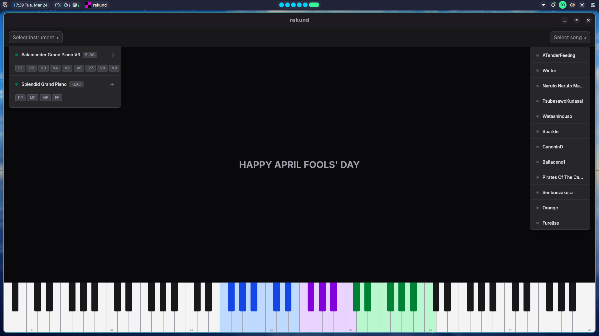

[]()
[]()
[]()

**Rakund** is a high-performance, cross-platform piano simulator built with a Rust backend and SolidJS frontend.

Every note played doesn't just produce a sound; it renders a specific color and physical particle on the screen, creating a mathematically precise fusion of audio and visual data.

---

## ✨ Demo & Showcase


### Interface Preview

| Manual Play Mode | Visualizer (MIDI Auto-play) |
| :---: | :---: |
|  |  |
| *Clean UI for manual QWERTY/MIDI input.* | *Real-time color rendering based on note frequencies.* |

---

## 🚀 Key Features

* **Dual Input Modes:** * **Manual Mode:** Play using a standard computer keyboard or external MIDI controller.
* **Low Latency:** Rust backend ensures zero-lag communication between the audio thread and the visual rendering thread.

---

## 🛠️ Tech Stack

* **Backend:** Rust (Core logic, Audio processing, MIDI parsing).
* **Frontend:** SolidJS (Cross-platform GUI bridging).

---

## 💻 Installation & Build

### Prerequisites
Make sure you have [Rust](https://www.rust-lang.org/tools/install) and the [Tauri CLI](https://tauri.app/v1/guides/getting-started/setup/) installed on your system. You should either install [direnv](https://direnv.net/) and [bun](https://bun.com/).

### Build Instructions
```bash
git clone https://github.com/doyouwantto2/rakund.git
cd rakund
direnv allow
bun run tauri dev

