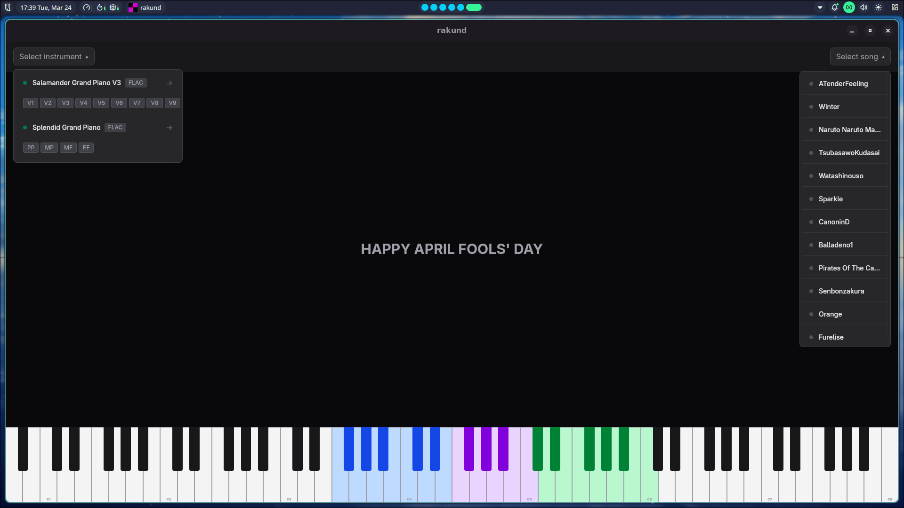

# Rakund

[]()
[]()
[]()

**Rakund** is a high-performance, cross-platform piano simulator built with a Rust backend and SolidJS frontend.

Every note played doesn't just produce a sound; it renders a specific color and physical particle on the screen, creating a mathematically precise fusion of audio and visual data.

---

## 🎥 Video

[](https://www.youtube.com/watch?v=eoPtckVYc3c)

### Preview

| Manual Play Mode | Visualizer |
| :---: | :---: |
|  |  |
| *Clean UI for manual QWERTY/MIDI input.* | *Real-time color rendering based on note frequencies.* |

---

## ✨ Key Features

- **Dual Input Modes** – Play using a standard computer keyboard or an external MIDI controller.
- **Low Latency** – Rust backend ensures fast communication between the audio thread and the visual rendering thread.
- **Audio-Visual Sync** – Notes are mapped to colors and particles in real time.

---

## 🛠 Installation & Build

### Development (NixOS)

```bash
git clone https://github.com/doyouwantto2/rakund.git
cd rakund
direnv allow
bun install
bun run tauri dev
```

### Linux

Extract the tar files (e.g. `salamander.tar`, `splendid.tar`) into `~/.config/rakund/instruments`.  

./.config/
└── rakund
    ├── instruments
    │   ├── salamander
    │   └── splendid
    └── songs

### Windows

On Windows, use `%APPDATA%\rakund` as the base directory.  

AppData/
└── rakund
    ├── instruments
    │   ├── salamander
    │   └── splendid
    └── songs
